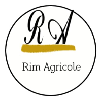

# AIoTU
[]
## Descriptio
**bold** AIoTU is a platform designed to manage farms using AI and IoT, providing farmers with real-time climate data from both OpenWeather APIs and installed sensors. Additionally, it integrates USSD services with the help of Africa's Talking to assist farmers in areas where there is no internet connection, allowing them to benefit from our services.

[]
[]

## Installation:
git clone https://github.com/ChefSI/AIoTU.git
pip install -r requirements.txt
python manage.py makemigrations
python manage.py migrate
python manage.py createsuperuser

## License:
Our project is under the MIT license.

## USSD Service

[]
[]
[]
[]
[]
[]
[]
[]

